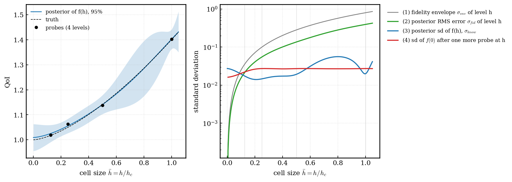

# Yi-h: grid-convergent multi-fidelity learning (problem definition, algorithm, assumptions)

**Labels:**
- **[data]**: a measurement in this project; the script is named.
- **[inference]**: reasoning that is not tested.
- **[assumption]**: a choice that is not tested.

A statement with a citation comes from the cited work.

---

## 0. Summary

**The engineering problem.** A simulation code computes a quantity of interest (QoI) \(y(x, h)\) at inputs \(x\) and numerical resolution \(h\). Examples are mean or maximum wall shear, a mass-transfer coefficient, or a mixing time.
- Finer resolution costs much more (often \(2^{\gamma}\) per halving of \(h\), with \(\gamma\) from 2 to 5).
- The engineer wants the converged value \(f(x)\) over a design region, with a stated uncertainty, inside a compute-time budget. \(f(x)\) is the median outcome of a run as \(h \to 0\). This equals the mean when the run-to-run spread is symmetric on the physical scale (Section 2.2 gives the reason for the median).
- Two literatures each solve half of this problem (details and sources in the guide, Section 11):
  - **Solution verification** (Eça & Hoekstra 2014; probabilistic Richardson extrapolation, 2401.07562) estimates the converged value at **one** condition.
  - **Multi-fidelity regression** (Yi et al. 2407.15110, and the works cited in the guide, Section 11) predicts over **all** conditions, but its target is the most expensive fidelity that was run, not \(h = 0\).
  - A small line of work joins the two halves (Tuo–Wu–Yu; CONFIG 2209.13748; Boutelet & Sung 2503.23158; DNA 2506.08328; Stroh et al.). Among the works cited, none combines a learned rate, calibrated uncertainty at \(h = 0\), and sequential budget-aware design over a design region.

**The method (Yi-h).** It keeps the structure of Yi et al.'s KRR-LR-GPR: abundant cheap data, a linear transfer between fidelities, and a Bayesian residual. It makes every part Bayesian, and it adds four things:
1. Any number of resolution levels in one likelihood. No level is the truth.
2. A covariance in \(h\) that encodes convergence (an E&H-type power law, \(h^p\), with \(p\) learned).
3. The target is \(h = 0\). The uncertainty of that extrapolation is part of the answer.
4. Cost-aware sequential design. It decides which inputs and which resolutions to run next, until the uncertainty is below a tolerance or the time budget is used.

Optional modules use special structure when a problem has it (Section 4).

---

## 1. Problem definition (generic)

**Given:**
- **Inputs:** \(x \in X \subset R^d\), with \(x = (u, v)\). Here \(u\) are the controls that a run sets (for example a speed and an angle), and \(v\) are output coordinates that one run returns many of (for example a threshold χ). \(v\) can be empty.
  - \(\Sigma \subset X\) is the region of interest. \(\Sigma_N\) is a scrambled Sobol set of \(100 d\) points in \(\Sigma\), on which every "max over \(\Sigma\)" is computed.
  - All coordinates are scaled to [0, 1] over \(\Sigma\) inside the kernels.
- **Resolution:** a vector \(h = (h_1, ..., h_k) \in (0, \infty)^k\), with \(k \ge 1\). Examples: a cell size, a time step, the cell size of a scalar solved on its own grid.
  - Each component takes discrete values with any refinement ratio, \(h_{j,\ell+1} = h_{j,\ell}/r_{j,\ell}\) with \(r_{j,\ell} > 1\). Finer values are always allowed; the budget is the only limit.
  - Inside the kernels, \(\bar h_j = h_j / h_{j,c}\), where \(h_{j,c}\) is fixed at Step 0 (the coarsest candidate value). It does not change when a level is removed later, so the priors keep their meaning.
  - Vectors are ordered componentwise: \(h \le h'\) when \(h_j \le h_j'\) for every \(j\).
  - \(h = 0\) means the exact solution of the model equations.
- **Probe:** one run \(a = (u, h, T)\), with run length or other run setting \(T\). It returns a vector \(y_a\) at the coordinates \(O(a) \subset X\). In the generic case \(O(a) = \{u\}\).
- **Cost:** \(c(a) > 0\), in core-hours. It is unknown and is learned.
- **Budget** \(C\) (core-hours) and **tolerance** \(\varepsilon\) on the physical scale, relative (\(\varepsilon_{rel}\)) or absolute.

**Quantities to model and report** (the uncertainties are defined in Section 2.8):

| Symbol | Meaning | Decreases as \(h \to 0\)? |
|---|---|---|
| \(f(x)\), \(m_y(x)\) | the converged value (median run outcome at \(h = 0\)), and its posterior median | — |
| \(\sigma_{epi}(x)\) | epistemic: uncertainty about \(f(x)\); more runs reduce it | it decreases as data are added |
| \(s_0(x)\) | aleatoric: run-to-run spread at \(h = 0\) | no trend is imposed (Section 2.4) |
| \(\sigma_{env}(x, h)\) | fidelity envelope, in \(\Lambda\) units: the RMS size of the error of level \(h\) under the posterior error model, mean and random part (Section 2.8) | **yes**, monotone to 0 by construction (Fig. E, curve 1) |
| \(\sigma_{fid}(x, h)\) | posterior RMS error of level \(h\) against \(f(x)\), on the physical scale | it is 0 at \(h = 0\) and tends to the true error \(\lvert\delta(x,h)\rvert\), so it is monotone only if the true convergence is monotone (Fig. E, curve 2) |
| \(\sigma_{know}(x, h)\) | knowledge: the posterior sd of \(f(x, h)\) | **no**: it is small where data exist (Fig. E, curve 3) |

**Problem P1.** Find a sequential policy that chooses batches of probes \(a_1, ..., a_N\) and stops, so that

$$ \min \sum_i c(a_i) \quad \mathrm{s.t.} \quad \max_{x \in \Sigma_N} \sigma_{epi}(x \mid D_N) / \varepsilon(x) \le 1, \quad \sum_i c(a_i) \le C $$

and the calibration gates pass (Section 3). Here \(\varepsilon(x) = \varepsilon_{rel} m_y(x)\) or \(\varepsilon_{abs}\).

**Problem P2,** when P1 is infeasible within \(C\): minimise \(\max_{\Sigma_N} \sigma_{epi}/\varepsilon\) subject to \(\sum c \le C\). Report "not met", the value reached and where.

Notes:
- The constraint bounds \(\sigma_{epi}\), because compute can reduce only that part. \(s_0\) and \(\sigma_{tot}\) are modelled and reported (both defined on the physical scale in Section 2.8).
  - Design criteria use the de-noised variance for this reason: Binois et al. 1710.03206 eq 2.
- The bound is pointwise. It is not a simultaneous band.
- Stacking designs (Sung, Ji, Mak, Wang, Tang, 2211.00268 eq 6, 13) solves P1 for deterministic codes with known cost. Ehara & Guillas 2104.02037 Prop. 2 solves the budget form P2.

*Fig. E (synthetic). Left: data at 4 levels and the posterior of \(f(h)\). Right, against \(h\):*
- *(1) the fidelity envelope \(\sigma_{env}\) (here \(\Lambda\) is the identity, so its units equal the physical scale);*
- *(2) the posterior RMS error of level \(h\), which is \(\sigma_{fid}\);*
- *(3) the posterior sd of \(f(h)\), which is \(\sigma_{know}\);*
- *(4) the sd of \(f(0)\) after one more probe at \(h\).*

*(1) goes to 0 monotonically by construction: "finer is closer to the truth" is in the prior. (2) is monotone here because the synthetic truth converges monotonically. With an oscillating truth, \(1 + 0.4 h^{1.5} \cos(2\pi h)\), (2) is 0.186 at \(\bar h = 0.5\) and 0.117 at 0.75. (4) decreases for finer probes: "finer is more informative". (3) is not monotone, because it describes what we know about each level, and we know most where we measured.*

---

## 2. Model: Yi-h

### 2.1 What Yi et al. do (2407.15110)

- Eq 1: \(f^h(x) = g(f^l(x), x) + r(x)\). The three parts are an LF model trained on LF data, a transfer model, and a residual model.
- Eq 2 is the linear special case \(f^l(x)\rho + r(x)\). Eq 4 allows a polynomial \(g\).
- The LF model is a deterministic KRR. The coefficients \(\rho\) come from GLS (Algorithm 1). \(r\) is a GP, with homoscedastic noise (App. A eq 7).
- The setting is "scarce, resource-intensive high-fidelity data with abundant but less accurate low-fidelity data" (abstract).
- There are two levels and no resolution variable. The target is \(f^h\).

### 2.2 The extension: Yi's transfer as a function of resolution

No part of the model is a deterministic plug-in. The cost of this is acceptable because the target problems have at most about 10 inputs.

For output \(k\) of probe \(a\):

$$ \Lambda(y_{a,k}) = \rho_0(x_k, h_a) + \rho_1(x_k, h_a) \, \mu(x_k) + \delta(x_k, h_a) + e_{a,k} $$

$$ \rho_0 = \sum_{j=1}^{k} c_{0j} \bar h_j^{p_j(x)}, \qquad \rho_1 = 1 + \sum_{j=1}^{k} c_{1j} \bar h_j^{p_j(x)} $$

| Term | Role | Relation to Yi |
|---|---|---|
| \(\mu(x)\) | the converged value in \(\Lambda\)-space; a GP with a linear mean \(\beta_0 + \beta^T x\) (or a physical basis) | Yi's high-fidelity target, moved to \(h = 0\) |
| \(\rho_0, \rho_1\) | a linear transfer between the converged value and level \(h\). The coefficients go to \((0, 1)\) as \(h \to 0\) with the E&H power law. | Yi's linear transfer (eq 2, eq 4 with \(M = 2\)), made a function of \(h\) |
| \(\delta(x, h)\) | GP residual of level \(h\), with the convergence kernel of Section 2.3; \(\delta(x, 0) = 0\) | Yi's residual \(r\), made a function of \(h\) |
| \(e_a\) | run-to-run noise vector, heteroscedastic, correlated inside a run | generalises Yi's homoscedastic noise |
| \(\Lambda\) | monotone output transform (identity, log, reciprocal, ...). Named \(\Lambda\) because Yi's \(g\) is the transfer model. | new; chosen per QoI (Section 2.7) |

- **Every level is in one likelihood**, the cheapest included. \(\mu\), \(\rho\), \(\delta\) and all hyperparameters are inferred jointly (Section 2.5).
- **Exact inference:** for given \((c, p)\) and hyperparameters, the model is linear and Gaussian in \((\mu, \delta)\). So these two integrate out exactly, and the MCMC runs only over the low-dimensional rest.
- **Cost:** at most about 10 inputs and a few thousand runs, so exact GP algebra is affordable. One solve with \(n = 2000\) costs about \(3 \times 10^9\) flops.
- **Target:** \(f(x) = \Lambda^{-1}(\mu(x))\).
  - The noise is symmetric with zero median in \(\Lambda\)-space, and \(\Lambda\) is monotone. So \(f(x)\) is the **median** run outcome at \(h = 0\) for **every** transform, because a median does not change under a monotone map.
  - So all candidate structures estimate the same quantity, and Section 2.7 can pool them.
- **Optional external cheap source** (module S8): a different, cheaper model, not a resolution of this code (a reduced-order model, a correlation).
  - Its data are \(y_s = f_s(x) + e_s\), with \(f_s\) a GP, and \(\mu(x) = \beta_s f_s(x) + r(x)\), all in the same likelihood.
  - This is Yi eq 2 between the source and the converged value, with a GP for the low fidelity. Yi §2 describes this as the data-scarce literature's choice: "MF models use GPRs for both \(f^l(x)\) and \(r(x)\) and implicitly assume a linear transfer-learning model". Yi's own choice for that slot is a deterministic KRR.

**Yi is a special case [inference, by construction].** Take two levels \(h_l > h_h\) with \(\Lambda\) the identity, and remove \(\mu\) from the two equations:

$$ f(x, h_h) = \rho_0' + \rho_1' \, f(x, h_l) + r'(x) $$

- Here \(\rho_1' = \rho_1(h_h)/\rho_1(h_l)\) and \(\rho_0' = \rho_0(h_h) - \rho_1' \rho_0(h_l)\).
- \(r' = \delta(x, h_h) - \rho_1' \delta(x, h_l)\) is a GP. It contains the coarse level's own error \(\delta(x, h_l)\), so it is **correlated with** \(f(x, h_l)\). Yi's residual is independent of the low-fidelity predictor. So the result has Yi's **form**, and it is Yi's **model** only if \(\delta(x, h_l) \equiv 0\), or if \(r'\) is uncorrelated with \(f(x, h_l)\), which needs \(k_h(h_h, h_l) = \rho_1' k_h(h_l, h_l)\) (a Markov property in \(h\) that does not hold in general). Otherwise Yi's fitted \(\rho\) absorbs part of the grid error (on the guide's toy problem, the correlation is \(-0.93\)).
- This is Yi's eq 2 (and eq 4 with \(M = 2\)) when that holds and all of these also hold:
  - the orders \(p_j\) do not vary with \(x\), so \(\rho'\) is constant;
  - \(f(x, h_l)\) is replaced by a deterministic KRR fit (Yi's LF model);
  - the residual kernel is Yi's RBF (Yi eq 5);
  - the noise is homoscedastic and uncorrelated (\(R = I\), \(\zeta \equiv 0\), \(b_s = 0\));
  - the coefficients have a flat prior;
  - the hyperparameters come from ML-II with the concentrated likelihood (Yi Algorithm 1, step 2.2);
  - the target is \(f(x, h_h)\), not \(f(x, 0)\).

**What Yi-h adds to Yi:**
- the transfer coefficients and the residual are functions of \(h\) that converge to the identity and to zero;
- any number of levels in one likelihood;
- the target at \(h = 0\);
- full Bayesian inference, including the order \(p\);
- heteroscedastic, within-run-correlated noise;
- cost-aware design.

### 2.3 Convergence covariance in \(h\)

For one resolution component:

$$ \delta \sim GP(0, \; \sigma_\delta^2 k_x(x, x') k_h(h, h')) $$

Two families are candidates for \(k_h\), and Section 2.7 weights them. Several components and an order that varies with \(x\) follow below.

- **TWY2 (Richardson type)**, for one component: \(k_h = (\bar h \bar h')^{p} c_\nu(\bar h - \bar h'; \ell_h)\), with \(c_\nu\) a Matérn correlation with \(\nu = 3/2\). Bect §4.3 found \(\nu = 1/2\) or \(3/2\) good. Proposed by Tuo, Wu & Yu (2014, Technometrics 56:372–380); Bect et al. call it the model "considered—but not advocated" there. The name TWY2 is from Bect et al. 2103.14559 §3.
  - Bect et al. 2103.14559 Prop. 3 (one component): \(\delta(h) = A h^p + o(h^p)\) almost surely. This is the E&H power law, with the amplitude a GP in \(x\).
  - It has the same structure as PRE 2401.07562 eq 10.
  - Bect §4.3: TWY2 intervals were "simultaneously smaller than the GCI interval and with a good coverage".
- **LB (lifted Brownian):** Boutelet & Sung 2503.23158 eq 4, with \(\gamma \in (0,1)\) controlling "the correlation between increments". It extends the lifted Brownian kriging model of Plumlee & Apley (2017, Technometrics 59:165–177), as stated in Boutelet & Sung §2.2.
  - The Brownian kernel of Tuo–Wu–Yu, \(\min(h,h')^{2p}\), is \(\gamma = 0.5\).
  - Bect Prop. 2: in that case the Richardson form "does not hold".
  - Boutelet Fig. 1: increments are positive for an average-type QoI, and "somewhat uncorrelated or negatively correlated" for a maximum-type QoI.
- **Several resolution components: an additive error.**

$$ \delta(x, h) = \sum_{j=1}^{k} \delta_j(x, h_j), \quad \delta_j \sim GP(0, \; \sigma_{\delta,j}^2 k_{x,j}(x, x') k_{h,j}(h_j, h_j')) $$

  - The \(\delta_j\) are independent. The error vanishes only when **every** component goes to 0. A product kernel would vanish when any one component goes to 0, so refining the flow grid alone would remove the scalar-grid error, which is wrong.
  - Boutelet & Sung §2.1, citing Ji et al.: the error must stay non-negligible while any component is nonzero. CONFIG 2209.13748 eq 19 is an alternative.
- **Order that can vary with \(x\)** (assumption A3; **TWY2 only**): \(\delta_j = \bar h_j^{p_j(x)} e_j(x, h_j)\) with \(e_j\) a stationary GP, and \(\log p_j(x) = \log p_{j0} + \pi_j(x)\). LB keeps one shared order per component, because its order sits inside the kernel's power and no varying form was read for it.
  - \(\pi_j\) is a GP with a PC prior that shrinks its variance to 0, so the base model is one shared order [inference]. The data switch the variation on only if they need it.
  - The covariance stays valid: \(b(z) b(z') k(z, z')\) is positive semi-definite for any function \(b\), here \(b = \bar h^{p(x)}\).
- **Properties:**
  - The prior variance of the error is \(\sum_j \sigma_{\delta,j}^2 k_{x,j}(x,x) \bar h_j^{2p_j(x)}\). It goes to 0 as \(h \to 0\), and it is monotone in the componentwise order.
  - The orders are learned (Section 2.5).

#### Error shape (optional)

By default every level obeys one power law, \(b(\bar h) = \bar h^{p}\), in the two places where it enters: the trend (\(\rho_0 = \sum_j c_{0j} b_j\), \(\rho_1 = 1 + \sum_j c_{1j} b_j\)) and the TWY2 kernel (\(k_h = b(\bar h) b(\bar h') c_\nu\)). `ModelConfig.shape` replaces \(b\) in both places by one function `kernels.err_shape`, for \(h_k\) = TWY2 only (LB raises `ValueError`). Each shape has \(b(0) = 0\) and a finite gradient at 0. Extra parameters `aux` (2 entries) are shared by all components.

- `"power"` (default): \(b = \bar h^{p}\). No `aux`. Reproduces the earlier numbers bit for bit.
- `"saturating"`: \(b = \bar h^{p} / (1 + (\bar h / h_s)^m)^{p/m}\), \(h_s = e^{\mathrm{aux}_0}\). It is \(\approx \bar h^{p}\) for \(\bar h \ll h_s\) and tends to \(h_s^{p}\) for \(\bar h \gg h_s\). \(h_s \to \infty\) gives the power law.
- `"two_term"`: \(b = \bar h^{p} + w \bar h^{q}\), \(w = \mathrm{aux}_0\), \(q = p\,u\), \(u = \mathrm{sigmoid}(\mathrm{aux}_1)\), so \(0 < q < p\): a lower-order second term.

Stated assumptions (none comes from the data of a particular application):

- The sharpness \(m\) of the saturating shape is fixed: `ModelConfig.sat_m = 4.0`. It is not inferred.
- Prior of the saturating shape: \(\log h_s \sim \mathrm{Uniform}[\log(h_{\min}/2),\ \log(8 h_{\max})]\), with \(h_{\min}\), \(h_{\max}\) the smallest and largest positive \(\bar h\) of the real data rows. It is a bounded coordinate for the slice sampler.
- Prior of the two-term shape: \(w \sim N(0, 1)\) and \(\mathrm{aux}_1 \sim N(0, 1)\).

### 2.4 Noise

$$ e_a \sim N(0, S_a), \quad S_a = D_a R_a D_a $$

- Runs are independent. Inside a run, \(R_a\) correlates the outputs.
  - Matrix-normal emulators count one run as one correlated vector: Overstall & Woods 1506.04489 eq 2. We keep \(R\) separate from the signal correlation.
- \(D_a\) is the diagonal of the noise sd: \(\log s^2(x, h) = m_s + \sum_j b_{s,j} \bar h_j + \zeta(x, h)\), with \(\zeta\) a latent GP.
  - hetGP 1611.05902 eq 14 smooths latent log-variances, so it works with few replicates.
- The trends \(b_{s,j}\) have symmetric priors, so the spread may grow or shrink as \(h \to 0\).
  - Analogous evidence: in an LES study the Lyapunov growth rate increases on finer meshes (1801.03046 §4.2).
- A replicate is a run with a small perturbation (for example a shifted start of the measurement). Whether that spread equals the physical spread is assumption A7.

### 2.5 Priors (all proper) and inference

| Parameter | Prior | Source |
|---|---|---|
| \(\beta\) (mean of \(\mu\)) | flat if no link and the basis matrix has full column rank; else Gaussian, centred on a physical estimate | improper posterior otherwise [inference] |
| \(c_{0j}\), \(c_{1j}\) | Gaussian with sd \(S_c\): the plausible size of the coarsest-level error relative to the converged value, in \(\Lambda\) units | proper, because \(c_{1j}\) multiplies \(\mu\) |
| \(\beta_s\) (module S8) | Gaussian | |
| \(p_{j0}\) | \(\log p_{j0} \sim N(0, 1)\) | wide; covers E&H's range |
| \(\pi_j\) (variation of \(p\) with \(x\)) | PC prior: \(P(\sigma_\pi > 0.3) = 0.05\), \(P(\ell < 0.1) = 0.05\) | shrinks to one shared order [assumption] |
| Matérn variance and range (\(r\), \(\delta\), \(\zeta\), \(R\)) | PC prior: \(P(\ell < 0.1) = 0.05\), \(P(\sigma > S) = 0.05\) | Fuglstad et al. 1503.00256 Thm 2.6, for an isotropic Matérn with \(d \le 3\); the paper says this limit "cannot be removed" (§2.3). Their range parameter equals \(2\ell\) in our Matérn form. One \(d = 1\) prior per input of an ARD kernel with up to 10 inputs is a **heuristic, not a derived PC prior** [assumption]. G7 tests its influence. |
| \(\gamma\) (LB) | Uniform(0, 1) | |
| \(m_s\), \(b_{s,j}\) | Gaussian; \(b_{s,j}\) symmetric, with sd \(\log 4\) | [assumption] |

- The scales \(S\) are problem-specific, and they are the only problem-specific part (R7).
- A **known admissible range** (for example a positive rate) goes into the prior through a link, \(\mu = \psi(\tilde\mu)\). It does not go into a gate.
- **Sampling:** Gibbs.
  - Latent Gaussian fields use elliptical slice sampling. Murray, Adams & MacKay 1001.0175: it "has no free parameters" (§2.4). It needs a zero-mean Gaussian prior with a fixed covariance during the update (§2), so the mean levels (for example \(m_s\)) are sampled as separate variables (§2.5). It is efficient mainly when the prior dominates the likelihood (§2.5).
  - Their hyperparameters use the surrogate-data slice sampler. Murray & Adams 1006.0868 (abstract): it "requires little tuning while mixing well in both strong- and weak-data regimes". Its automatic form needs a likelihood that factorises over sites (§3.2). Given the other field, each of our two blocks does. The paper tested only fixed observation noise (§5), so its use with a latent log-variance field is [inference].
  - Censored values use data augmentation.
- **Convergence rule:** 4 chains. For every reported quantity, \(\hat R < 1.01\), where \(\hat R\) is the maximum of the rank-normalised split-\(\hat R\) and the folded split-\(\hat R\), and bulk-ESS > 400. Vehtari et al. 1903.08008 §2 and §4.1. We also require tail-ESS > 400 [assumption; the paper uses 400 for tail-ESS only in its examples].
- Why sample at all: ML-II "underestimate[s] prediction uncertainty" (1912.13440 §1).

### 2.6 Cost model

The model is learned from the costs that the oracle reports for each run (core-hours, or any work unit):

$$ \log_2 c = \kappa_0 + \sum_j g_j(\ell_j) + a \, (\log_2 \hat c - \bar q) + \omega(u, \ell) + \eta, \qquad g_j(\ell) = \sum_{m < \ell} \Delta_{j,m} $$

- \(\ell_j\) is the level index of component \(j\) (0 = coarsest); \(\hat c\) is the oracle's optional cost quote (the term is absent without one; \(\bar q\) centres it). The oracle decides how to run a probe (warm starts, checkpoints), so its savings appear in the reported costs.
- \(\Delta_{j,m}\) is the log2 cost step of one refinement of component \(j\) from level \(m\) to \(m + 1\). Its prior is a random walk over the levels: \(\Delta_{j,0} \sim N(\gamma_j, s_{\gamma,j}^2)\) and \(\Delta_{j,m+1} = \Delta_{j,m} + \varepsilon_{j,m}\), \(\varepsilon_{j,m} \sim N(0, s_{\Delta,j}^2)\). So the step may grow or shrink with the level (e.g. more processors, longer runs at finer grids), and the extrapolation variance grows like \(\ell^3\). \(\gamma_j\), \(s_{\gamma,j}\) and \(s_{\Delta,j}\) are problem-specific and required inputs (no defaults).
- \(\omega\) is a GP over \((u, \ell)\), so the cost can also depend on the inputs; \(\eta\) is run-to-run scatter. \(a \sim N(1, 0.5^2)\): a quote is informative but not trusted.
- Given the GP hyperparameters, \(\log_2 c\) is Gaussian and \((\kappa_0, \Delta, a, \omega)\) are integrated out exactly; the GP hyperparameters are slice-sampled; a run stopped at its cap gives a right-censored cost (Tobit, by data augmentation).
- **A run is stopped at its cap \(\bar c\)** (the 0.95 quantile of its predictive cost), so the cost it is charged is \(\min(c, \bar c)\), and a stopped run returns no output. The acquisition therefore uses the expected charged cost \(E[\min(c, \bar c)]\) and multiplies the expected gain of a run by \(P(c \le \bar c)\).
- Snoek 1206.2944 §3.2 puts a GP on log cost. Guinet 2011.11456 reports that simple cost models often predict better, so the prior mean carries most of the weight when data are few.

### 2.7 Several candidate structures

- A structure is \(M = (k_h\) family, \(\Lambda\), set of levels used\()\).
- **Weights by stacking on an extrapolation score.**
  - Fit every \(M\) without the finest level, and score the held-out finest-level runs. This tests extrapolation in \(h\).
  - The scores are log densities **on the physical scale**, with the Jacobian of \(\Lambda\) included, so structures with different transforms are compared fairly.
  - Yao, Vehtari, Simpson & Gelman 1704.02030 eq 2.2 (log score). They recommend stacking because BMA "is flawed in the M-open setting".
  - **Extrapolation hold-out** [inference]: Yao et al. define and justify eq 2.2 with leave-one-out densities (§2.1–2.2). They do not discuss extrapolation hold-outs. A held-out finer level is scored here instead, because that task (predict one level finer than the data) is the closest available match to the real task (predict \(h = 0\)). This needs its own validation; assumption A13 records it.
  - Yao §2.3 warns that LOO "has large variance when the sample size is small". Our held-out sets are small, so the weights are noisy (see the minimum sample below).
  - A Dirichlet(2, ..., 2) penalty regularises the weights. Their §4.1 suggests "a strong prior … to the weights"; Dirichlet(2, ..., 2) is a choice [assumption].
- **Cross-fitting:** the weights come from half of the held-out sites, and the calibration (Gate G1) from the other half; then swap.
- **Minimum sample:** each half needs at least 6 held-out sites [assumption]. With fewer, the weights stay equal, and G1 is reported as "not testable", never as "passed".
- With only 2 levels left, \(p\) is not identifiable there. Then the weights stay equal and are flagged.

### 2.8 Prediction on the physical scale

- Pool the posterior draws over the structures with their weights, and back-transform them with \(\Lambda^{-1}\).
- \(m_y\) is the median. \(\sigma_y = (q_{84} - q_{16})/2\).
- Quantiles exist for every transform. For example, if a rate is Gaussian, the time \(1/\)rate has no finite moments.
- The Gaussian of the requirement is \(N(m_y, \sigma_y^2)\). Gate G6 checks its shape.
- \(\sigma_{epi}\) is \(\sigma_y\) of \(f(x)\).
- \(\sigma_{fid}(x,h) = (E[(f(x,h) - f(x))^2 \mid D])^{1/2}\), computed from the same draws.
- **Fidelity envelope**, in \(\Lambda\) units (relative error for \(\Lambda = \log\)):

$$ \sigma_{env}^2(x, h) = E_{\vartheta, c, \mu \mid D} [ \sum_j \bar h_j^{2 p_j(x)} ( (c_{0j} + c_{1j} \mu(x))^2 + \sigma_{\delta,j}^2 k_{x,j}(x, x) ) ] $$

  - The error of level \(h\) is \(\rho_0 + (\rho_1 - 1)\mu + \delta\). The envelope includes both its power-law part and its random part, so it does not understate the error when the mean explains most of it.
  - It is a sum of per-component squares, so there are no cross terms that could cancel. Each posterior draw is monotone in the componentwise order, so the average is monotone too. It is 0 at \(h = 0\), and it is finite because the posterior of \(c\) is proper.
- **Aleatoric spread on the physical scale:** \(s_0(x)\) is the quantile half-width \((q_{84} - q_{16})/2\) of \(\Lambda^{-1}(\Lambda(m_y) + e)\), with \(e \sim N(0, s^2(x, 0))\), over the posterior draws of \(s\). It is reported as "not identified" when replicates exist at fewer than 3 levels, or when the posterior sd of the trend \(b_s\) is more than half its prior sd.
- \(\sigma_{tot}\) is the quantile spread of draws of \(\Lambda^{-1}\)(target + noise) at \(h = 0\). This is the only definition; it is not \(\sigma_{epi}\) and \(s_0\) added in quadrature, because they are on scales that do not add.

---

## 3. Algorithm

**Step 0, set the problem.** Choose \(\Sigma\), \(\varepsilon\), \(C\) and the batch size \(q\). Choose the candidate transforms, an external cheap source if one exists (module S8), the prior scales, and the optional modules of Section 4.

**Step 1, initial design.**
- **Cheapest level:** a space-filling design, as large as is useful. This is Yi's abundant LF, and all of it enters the likelihood.
- **Prerequisite: the A12 test,** before the first real campaign. Step 5 values probes at unprobed finer levels correctly only if A12 holds.
  - Synthetic truths: 20 random draws of \(f(x, h) = f_0(x) + a(x) \bar h^{p}\), with \(x\) in 2D and \(p\) drawn from [0.7, 2.5]. There is data at \(\bar h = 1, 1/2, 1/4\), and candidates also at \(\bar h = 1/8\) and \(1/16\), with cost \(\propto 2^{3\ell}\).
  - Candidates: the acquisition's best candidate at EACH level 0-4 (5 candidates, so finer unprobed levels are always
    compared), plus its overall best.
  - Oracle: the value (expected reduction of \(H\)) of each candidate, from full MCMC refits on fantasy outcomes,
    with enough fantasies that its Monte Carlo standard error is below 10% of the value (report it).
  - Pass rule [assumption; a top-3 ranking among near-equal candidates would measure mostly oracle noise]:
    (i) regret: the oracle value per cost of the acquisition's choice is at least 0.8 times the oracle's best
    in at least 16 of 20 truths; (ii) level calibration: for every level, the median over truths of
    (acquisition gain / oracle gain) is in [0.5, 2].
  - If it fails: replace the reweighting by short MCMC refits for the 5 best candidates of each step. This costs more, and the cost must be measured.
- **Ladder:** nested Sobol designs in \(u\) at the levels above it. Stacking designs eq 9 gives starting sizes.
- **Replicates:** at 3 or more levels at 3 or more sites.
- This minimum is necessary, not sufficient [inference].

**Step 2, fit.** Run MCMC for every candidate \(M\) (Section 2.5), then compute the stacking weights (Section 2.7).

**Step 3, gates (diagnostics and calibration).**

| Gate | Test | Pass rule |
|---|---|---|
| G0 order | posterior of \(p_{j0}\); observed increment ratios | \(P(p_{j0} > 0.5) \ge 0.9\) **and** the posterior sd of \(\log p_{j0}\) is at most 0.5 (half its prior sd), so the prior cannot pass G0 alone (the prior already gives \(P(p > 0.5) = 0.76\)). When \(P(\sigma_\pi > 0.05 \mid D) \ge 0.9\) (the order varies with \(x\)), it also needs \(P(p_j(x) > 0.5) \ge 0.9\) at every \(x \in \Sigma_N\). **A failure does not stop the method.** It means the limit is not yet identified, so \(\sigma_{epi}\) is large, and Step 5 then prefers finer levels if A12 holds. E&H treat \(p < 0.5\) as anomalous. |
| G1 level hold-out | cross-fitted prediction of the finest level, a predictive check of the finest mesh as in Oliver et al. 1311.0828 eq 17 | 95% coverage within binomial limits; no sign bias; \(C_{LOO}\) near 1 (Bachoc 1301.4320 eq 6) |
| G2 block LOO | leave out whole runs | z ~ N(0, 1); U statistic (Overstall & Woods eq 10) |
| G3 noise | replicate spread against \(s^2\) | chi-square, p > 0.05 |
| G4 pre-asymptotic | fit without the coarsest level; predict the coarsest level's runs (posterior predictive, noise included, pooled over draws) | whiten the residuals of those runs with the Cholesky factor of their pooled predictive covariance; pass if the chi-square test of the whitened sum has p > 0.01. On a fail, remove that level, but never below 3 levels [assumption]. Under the model this test has approximately its nominal size (the pooled draws are summarised by their first two moments); a statistic built on the realised posterior sds did not, because with learned hyperparameters a posterior sd can decrease when data are removed |
| G5 structure | monotone coordinates stay monotone | no violation on \(\Sigma_N\) |
| G6 shape | 2.5/97.5% quantiles against \(m_y \pm 1.96\sigma_y\) | median over \(\Sigma_N\) of the difference < 0.2 \(\sigma_y\); a warning in the report, not a blocking gate, because \(\sigma_y\) is a quantile half-width and P1 does not assume a Gaussian [assumption] |
| G7 prior | halve and double each prior scale (importance reweighting; refit if ESS < 400) | \(m_y\) moves < \(0.5\sigma_{epi}\) and \(\sigma_{epi}\) changes < 20%; else the output is flagged "prior-dominated" |

- **Repair:** at most 2 cycles per gate: remove a pre-asymptotic level (G4), recompute the weights, or buy a finer probe where \(|z|\) is largest.
- If a gate still fails, the output is labelled "uncalibrated". It is never silently reported as calibrated.
- The thresholds are [assumption].

**Step 4, stop or forecast.**
- **Success:** P1 holds and the gates pass.
- **Budget used:** report P2.
- **Forecast** (bounded cost):
  - Simulate the greedy policy of Step 5 with 20 fixed posterior samples (spread over the structures by their weights), for at most 50 steps or until success. Use variance-only updates and the expected reached set, with no fantasies and no reweighting.
  - Judge success on \(\sigma_{epi}\) of the **pooled** 20 samples, so the spread between samples and between structures stays in. Variance-only updates cannot shrink that spread, so the forecast is conservative about success.
  - Cost: about \(2 \times 10^8\) flops per sample and step (120 candidates, rank-10 updates at 400 data), so about \(2 \times 10^{11}\) flops for 20 samples and 50 steps.
  - **Known limit:** variance-only updates cannot shrink the spread between structures. When that spread exceeds \(\varepsilon\), the forecast says "P1 infeasible" from the first step and carries no information. A better forecast would also simulate how finer-level fantasies change the stacking weights. That is future work.
  - If the probability of exceeding \(C\) is above 0.5, tell the user the forecast. This is a report, not a stop: the method continues with the P2 criterion of Step 5.

**Step 5, acquisition: maximum uncertainty reduction per cost.**

$$ a^\star = \arg\max_{a \in A} \; (H_n - E J_n(a)) / E c(a), \qquad H_n = \sum_{x \in \Sigma_N} (\sigma_{epi}^2(x)/\varepsilon^2(x) - 1)_+ $$

- The ratio is MR-SUR (Stroh et al. 2007.13553 eq 11), with a hinge on \(H_n\) [inference], which is zero exactly when P1 holds.
- **P2 criterion.** When the forecast says P1 is infeasible, \(H_n\) becomes a soft maximum, \(\beta^{-1} \log \sum_{x \in \Sigma_N} \exp(\beta \sigma_{epi}^2/\varepsilon^2)\) with \(\beta = 20\) [inference]. This targets the max of P2 rather than a sum.
- **Budget enforcement.**
  - Every candidate gets a cap \(\bar c(a)\), the 0.95 quantile of its cost posterior. Its cost in the ratio below is \(E c(a) := E[\min(c(a), \bar c(a))]\), and its expected gain is multiplied by \(P(c(a) \le \bar c(a))\) (Section 2.6). A candidate is admissible only if \(\bar c(a) \le C_{rem}\), where \(C_{rem}\) is the budget minus the spent cost and minus the caps of all pending runs (each pending run is reserved at its cap).
  - A run that reaches its cap is stopped. Its cost is counted, and it is a right-censored cost datum: the cost model (Section 2.6) uses a censored (Tobit) likelihood for it. The outputs it reached are kept; outputs not reached are censored (module S1). In the generic case with one output, a capped run gives only the cost datum. With module S2, it can be extended later if budget remains.
  - So \(\sum c \le C\) holds by construction.
- **Not optimal.** The policy is greedy, with a one-step look-ahead. It does not claim to minimise \(\sum c\) (P1) or to reach the P2 optimum. It is a heuristic in the class of MR-SUR.
- **Candidates:** every \(u\) in a candidate set, **at every resolution, including resolutions finer than any run so far**, and every optional action of Section 4.
  - The cost model prices each candidate, and the acquisition chooses. So refinement happens when it is the best use of the budget (Fig. E, curve 4).
- \(J_n(a)\) is a Monte Carlo average over 16–256 fantasies. Each fantasy:
  - draws the hyperparameters and the latent noise;
  - draws the outputs, including which nested outputs are reached and which are censored;
  - conditions each posterior draw's GP exactly on the fantasy outputs (Gaussian conditioning);
  - reweights the hyperparameter draws by the fantasy likelihood. If the effective sample size of the weights falls below 50 [assumption], it keeps the current weights for that candidate. That is conservative: it ignores the value of reducing the uncertainty of \(p\). This happens most for probes at unprobed finer levels;
  - keeps the stacking weights fixed [assumption], recomputes \(H\), and clips negative gains (Monte Carlo noise in a quantile spread) at 0.
  - Snoek 1206.2944 §3.3 uses Monte Carlo over pending outcomes.
  - The number of fantasies is doubled until the Monte Carlo error is below 10% of the gap between the two best candidates.
- **Batches:** choose greedily, and condition on the pending runs. Takeno 1901.08275 eq 7–8; Kathuria 1611.04088.

**Step 6, run the batch, add the data, and go to Step 2.**

**Computational cost** [inference, order of magnitude]: for \(n\) up to about 2,000 data in the likelihood, about 120 candidates, 16 fantasies and 200 posterior samples, rank-10 updates cost about \(4 \times 10^7\) flops each, so one acquisition costs about \(10^{13}\) flops: hours on one node. This is small against one run at a fine level in typical CFD applications. MCMC time must be measured.

**Output:** for each \(x \in \Sigma\): \(m_y\), \(\sigma_{epi}\), \(s_0\) (or "not identified"), and \(\sigma_{tot}\); \(\sigma_{env}(x, h)\) and \(\sigma_{fid}(x, h)\) for the levels used; the posteriors of \(p_j\) and \(c\); the stacking weights; the gate table; the spent cost and the allocation per level.

---

## 4. Optional modules: assumptions that use the structure of a problem

Each module is generic. The core (Sections 1–3) works without any of them. A module states an assumption, how it changes the algorithm, and how to check it.

| # | Structure | Assumption | Change to the algorithm | Check |
|---|---|---|---|---|
| S1 | Nested outputs | One run returns the QoI at all values of an output coordinate up to a stopping value (a time-to-threshold curve, a load-displacement curve). | \(O(a)\) depends on the outputs; \(R\) correlates them; outputs not reached by \(T\) are censored. taKG 1903.04703 §2.3: shorter outputs come free. | G2 on whole runs |
| S2 | Pause and resume | Handled by the oracle, not by gcbml: the oracle runs a probe as cheaply as it can, and the cost model learns the realised costs and the optional cost hints. | — | — |
| S3 | Warm start across levels | Handled by the oracle, as S2. The oracle must make sure the result does not depend on the start. | — | — |
| S4 | Several resolution components | Parts of the model can be resolved separately. | \(h\) is a vector (Section 2.3); each part has its own order \(p_j\). | G0 per component |
| S5 | Several QoIs per run | One run gives many QoIs. | The criterion sums over QoIs, with weights \(1/\varepsilon_q^2\). Giles 1304.5472 §7.4. | — |
| S6 | Known admissible range | The converged value must be in a known range. | a link in the prior (Section 2.5) | G7 |
| S7 | Monotone coordinate | \(f\) is monotone in one coordinate. | Gate G5; enforce only if it is violated. López-Lopera 1901.04827 eq 8. | G5 |
| S8 | Cheap external source | A different, cheaper model (not a resolution of this code) correlates with the QoI. | \(\mu = \beta_s f_s + r\), with \(f_s\) a GP and its data in the likelihood (Section 2.2). | the posterior of \(\beta_s\) is away from 0 |

---

## 5. Core assumptions

| # | Assumption | Status | Test |
|---|---|---|---|
| A1 | \(\Lambda(y)\) is Gaussian | untested | G6; Q–Q plots of G2 |
| A1b | The QoI types the method is meant for (wall stress, transfer coefficients, times to a threshold) follow A3 | to be tested per application | G0 per QoI |
| A2 | The code converges, \(\delta(x, 0) = 0\) | fundamental; the data can show convergence only within the levels run | G0 |
| A3 | Leading power law in \(h\), with an order that is shared over \(X\) unless the data need \(p(x)\) | [assumption]. Bect Prop. 3 supports the power law for one QoI at one \(x\); nothing supports sharing across \(x\). | G0; posterior of \(\sigma_\pi\) (Section 2.3) |
| A4 | The \(k_h\) family | stacking weights | G1 |
| A5 | Separable \(k_x k_h\) | untested | G2 residuals against \(x\) |
| A6 | Noise trend in \(h\) of either sign | analogy only (1801.03046) | replicates |
| A7 | A perturbed replicate represents the physical spread | untested | experimental replicates |
| A8 | Stationary kernels in \(x\) | untested | G2 |
| A9 | (with S8) the external source is informative | posterior of \(\beta_s\) | reported |
| A10 | The coarsest ladder level is in the asymptotic range | per problem | G4 |
| A11 | (with S3) The warm start does not change the QoI | per problem | a direct comparison |
| A12 | Fantasy reweighting values the probes that reduce the uncertainty of \(p\) | [inference] | synthetic test |
| A13 | Stacking weights for one-level extrapolation transfer to \(h = 0\) | untestable without a finer level | a finer level |

---
